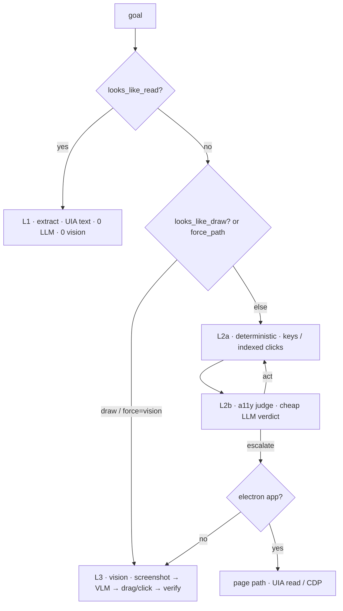
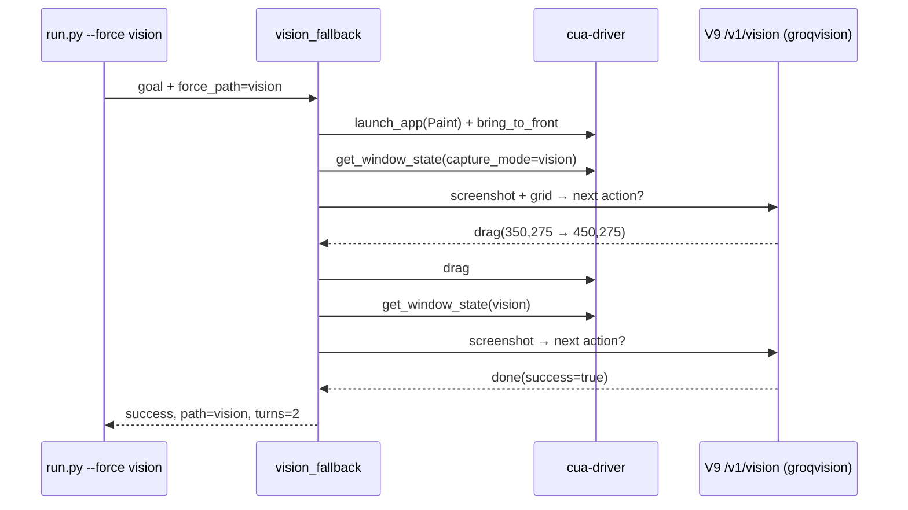

# Session 10 — Computer-Use Skill (Desktop Automation via cua-driver)

A `computer` skill that drives **real Windows desktop apps** through a running
`cua-driver` daemon — the desktop twin of the Session 9 `browser` skill. It plugs
into the growing-graph orchestrator via **one catalogue entry + one dispatch
branch**, routes every model call through the **V9 gateway** (`:8109`), and supplies
the five layers the driver does not: goal decomposition, perception interpretation,
scan-act-verify sequencing, error recovery, and vision fallback.

| Piece | Where | Role |
|---|---|---|
| cua-driver daemon | `\\.\pipe\cua-driver` | perception + action on real apps |
| V9 gateway | `http://localhost:8109` | `/v1/chat`, `/v1/vision`, provider routing |
| computer skill | `code/computer/` | the 5-layer cascade wrapper |
| trajectories | `code/state/runs/` | recording of every run (`start_recording`) |

---

## Architecture — the five-layer cheapest-first cascade

Every subgoal walks the cascade and stops at the first layer that works; the chosen
layer is surfaced as `output.path` (never hidden).



| Layer | `path` | Cost | Used for |
|---|---|---|---|
| L1 extract | `extract` | 0 LLM, 0 vision | read a value from the UIA tree |
| L2a deterministic | `deterministic` | 0 LLM | known key/click sequences (e.g. Calculator) |
| L2b a11y judge | `a11y` | 1 cheap LLM/turn | act on labelled UIA elements |
| Electron page | `page` | UIA / CDP | Electron apps (VS Code) |
| L3 vision | `vision` | 1 VLM/turn | **canvas / pixel targets (Paint)** |

Invariants enforced: **scan before any indexed action** (A) and **re-scan after every
state-changing action** (B); indices are turn-scoped, never reused across turns.

---

## Quick start

```powershell
# 1. cua-driver daemon
cua-driver status        # or: cua-driver autostart enable; cua-driver autostart kick

# 2. V9 gateway (loads Session 10/.env)
Start-Process -FilePath "uv" -ArgumentList "run","main.py" `
  -WorkingDirectory "F:\Agentic AI\agentic-ai-EAG\Session 10\llm_gatewayV9" -WindowStyle Hidden

# 3. run a task (from code/)  — CUA_DEBUG=1 prints every driver call
cd "F:\Agentic AI\agentic-ai-EAG\Session 10\code"
$env:CUA_DEBUG="1"
uv run python -m computer.tasks <calc|writefile|paint>                                  # the three recorded tasks
uv run python -m computer.run --app <App> --goal "<goal>" --force <a11y|vision|page>    # single attempt
uv run python flow.py "<natural-language query>"                                        # full orchestrator
$env:CUA_DEBUG=$null
```

> **Rule of thumb:** `flow.py` is the orchestrated path (planner → computer → formatter,
> with auto-replan on failure). `run.py --force <layer>` / `tasks` is a **single attempt**
> that pins the layer — use it for vision/canvas tasks (see quota notes below).

---

## Three tasks — chosen from the brief, recorded as evidence

Every run is captured with `start_recording`; the `trajectory_dir` is the submitted
evidence and `output.path` reports the cascade layer that won. The three tasks were
chosen from the brief's list and cover all three required constraints:

| Task | Brief option | Layer (`path`) | Constraint met | trajectory_dir |
|---|---|---|---|---|
| Calculator 42 × 18 = 756 | A — deterministic hotkeys | L2a `deterministic` | **zero vision** ✅ | `code/state/runs/run_1782059771` |
| VS Code → `hello_world.txt` | C — Electron page tool | `page` | **Electron page** ✅ | `code/state/runs/run_1782059608` |
| Paint — one canvas stroke | D — canvas forces vision | L3 `vision` | **uses vision** ✅ | `code/state/runs/run_1782057892` |

### Task 1 — Calculator 42 × 18 · **Layer 2a deterministic (zero vision, zero LLM)**

> **Goal:** `compute 42x18 then read the result`  (post-condition `756`)

| field | value |
|---|---|
| Entry | `tasks calc` |
| Path | `deterministic` (L2a) |
| Turns | `6` |
| Provider | — (no LLM, no vision) |
| Cost | `$0.00` |
| Result | `Display is 756` ✓ post-condition met |
| trajectory_dir | `code/state/runs/run_1782059771` |

_A fixed hotkey/click sequence (`4 2 × 1 8 =`) drives Calculator end-to-end with **zero
model calls**, then the result is read from the UIA tree. Satisfies "≥ 1 task completes
with zero vision calls."_

### Task 2 — VS Code → `hello_world.txt` · **Electron page path**

> **Goal:** `In VS Code, create a file hello_world.txt containing Hello World`

VS Code is the one installed Electron app whose UI is enumerable via UIA, so the write
runs through the `page` path with a deterministic decomposition (CDP is a Windows no-op).
Satisfies "≥ 1 task uses the Electron page path."

| field | value |
|---|---|
| Entry | `tasks writefile` (deterministic) |
| Path | `page` (Electron) |
| Turns | `11` decomposition steps |
| **Deliverable** | `C:\Users\HP\hello_world.txt` = `"Hello World"` — **verified on disk, exactly 11 bytes** |
| trajectory_dir | `code/state/runs/run_1782059608` (`success:true`, 8.3 s) |

**Deterministic write recipe** (`decompose_write_goal` in `skill.py`):
`open_path` (`code <no-space-path>` opens a *named* editor) → `bring_to_front`
(UIAccess worker → `landed_on_target:true`) → `hotkey [ctrl,1]` (focus editor) →
`hotkey [ctrl,a]` (select-all → type *replaces*, idempotent) →
`type_text dispatch:"auto"` (Electron drops background `WM_CHAR`, so the window must be
foreground) → `hotkey [ctrl,s]` (named file saves with **no Save As modal** — the modal
hangs cua-driver) → **verify the file on disk**.

> `_verify_write` reads the file off disk and **never trusts `get_text` / `success:true`** —
> if a save doesn't land it reports `FILE NOT SAVED` instead of a false success. The
> select-all makes the write idempotent (exactly 11 bytes, not 22 on a re-run). Creating a
> brand-new file is timing-flaky on the first attempt (Electron focus) and lands on retry.

### Task 3 — Paint one stroke · **Layer 3 vision** ⭐

> **Goal:** `Draw exactly ONE short stroke in the centre of the canvas, then finish immediately on the next turn.`

A pixel canvas exposes no actionable ARIA/AX, so this forces L3 vision. Satisfies
"≥ 1 task uses vision."

| field | value |
|---|---|
| Entry | `run.py --app Paint --force vision` |
| Path | `vision` (L3) |
| Turns | `2` |
| Provider | `groqvision` · `meta-llama/llama-4-scout-17b-16e-instruct` |
| Cost | `$0.00` (free tier) |
| Elapsed | `15.6 s` |
| Result | **success** — stroke drawn |
| trajectory_dir | `code/state/runs/run_1782057892` |



| turn | action | outcome |
|---:|---|---|
| 1 | `drag(x=350,y=275 → 450,275)` "draw a short stroke in the centre" | ok |
| 2 | `done(success=true)` ("vlm done") | done(True) |

Recording artifacts: `code/state/runs/run_1782057892/turn-00001/screenshot.png`,
`turn-00002/screenshot.png`.

_Earlier `flow.py` attempts on this canvas goal dead-ended on the a11y path (the judge
can't paint pixels) — that drove three generic fixes: `looks_like_draw()` routing (draw →
vision), the `groqvision` provider (fast/free, no gemini 503s), and `_vision_call` retry +
stale-window guards in `vision.py`._

---

## Recorded `trajectory_dir`s (the submitted evidence)

| trajectory_dir | task | path | turns | recording |
|---|---|---:|---:|---|
| `code/state/runs/run_1782059771` | Calculator 42×18=756 (L2a) | deterministic | 6 | [recording.html](code/state/runs/run_1782059771/recording.html) |
| `code/state/runs/run_1782059608` | VS Code → hello_world.txt (Electron) | page | 11 | [recording.html](code/state/runs/run_1782059608/recording.html) |
| `code/state/runs/run_1782057892` | Paint single stroke (L3 vision) | vision | 2 | [recording.html](code/state/runs/run_1782057892/recording.html) |

Each dir contains `session.json`, `cursor.jsonl`, and per-turn `screenshot.png` /
`action.json`; replay via cua-driver `replay_trajectory`. Each also has a
self-contained **`recording.html`** — the full driver-call timeline with every
screenshot embedded (base64), openable in any browser with no gateway/daemon
needed. Regenerate with `uv run python make_run_html.py`.

---

## Provider routing & the free-tier quota lesson

Vision is pinned to **`groqvision`** with gemini → ollama as automatic failover:

```
vision_provider_pin = "groqvision"          # skill.py
groqvision  = Groq LPU · Llama 4 Scout      # ~4 s/call, free, no 503s
   ↓ failover (via _vision_call None pass)
gemini      = ~6 s/call, free tier 503-flaky
   ↓
ollama      = qwen2.5vl:3b · ~205 s/call on CPU (no usable GPU here)
```

**Why the intermittent `503 … after retries + ollama failover`:** it is **rate-limit
exhaustion across a burst**, not a dead server. Each screenshot ≈ ~2,000 tokens; Groq's
free tier allows `tpm: 6000`. So:

| vision calls / attempt | ~tokens | vs 6000 tpm |
|---:|---:|---|
| 1 (read) | ~2,000 | ✅ safe |
| 2 (act + verify) | ~4,000 | ✅ fits |
| 3 (hit step cap) | ~6,000 | ⚠️ at limit → next call 503s |

`flow.py` adds the planner's **auto-replan**, which fires a *second* computer node seconds
later — doubling the burst and tripping the per-minute limit. **Quota-safe recipe:** use
`run.py --force vision`, keep it to **≤ 2 vision calls per attempt**.

---

## Key source files

| File | Role |
|---|---|
| `code/computer/skill.py` | cascade wrapper; `vision_provider_pin`, draw→vision routing, write recipe |
| `code/computer/layers.py` | `looks_like_read`, `looks_like_draw`, L1/L2 logic |
| `code/computer/vision.py` | L3 — capture → grid → `/v1/vision` → drag/click; `_vision_call` retry/failover |
| `code/computer/sequencing.py` | scan-act-verify loop + Invariants A/B |
| `code/computer/tasks.py` | the three recorded tasks (`calc`, `writefile`, `paint`) |
| `code/computer/run.py` | single-attempt runner (`--force`, recording) |
| `code/flow.py` | growing-graph orchestrator |
| `llm_gatewayV9/providers.py` | provider build; `VISION_MODEL_HINTS`, `groqvision` instance |
| `llm_gatewayV9/router.py` | `LIMITS`, `SHORTCUTS`, failover |
| `llm_gatewayV9/agent_routing.yaml` | `computer: gemini` chat pin |

---

## Troubleshooting

| Symptom | Cause | Fix |
|---|---|---|
| `503 … after retries + ollama failover` | free-tier token budget exhausted by a burst | use `run.py --force vision`, ≤ 2 calls/attempt; wait ~1 min |
| flow.py drawing runs 12 turns then fails | a11y judge can't paint pixels | drawing goals auto-route to vision (`looks_like_draw`); or `--force vision` |
| read goal returns instantly, no vision | `looks_like_read` → L1 extract (UIA) | expected; use `run.py --force vision` to exercise L3 |
| `Invalid window handle 0x80070578` | Win11 UWP app recreated its window | `vision.py` re-resolves the window each turn + retries on stale capture |
| `FILE NOT SAVED` creating a new file | Electron focus timing on a fresh editor | re-run (replacing an existing file is reliable) |
| vision call ~205 s | gemini down → ollama CPU fallback | ensure `groqvision` is up (`GROQ_VISION_MODEL` set, gateway restarted) |

---

## Related docs

- `code/README.md` — Session 9 browser replay report (8-point pipeline walk-through)
- `code/computer/README.md` — module-level computer skill docs
