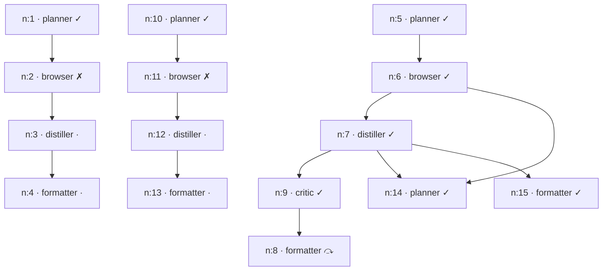
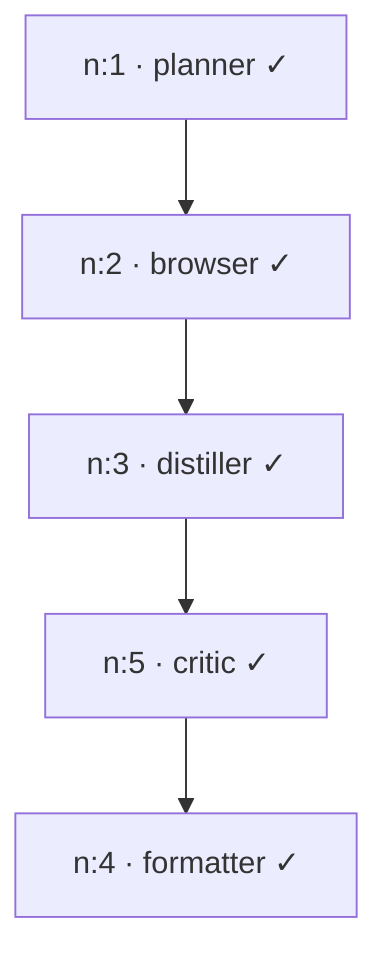

# Replay Report — Session 9 Browser Agent

_Browser-capable comparison run, walked through the official pipeline (Planner → Researcher → Browser → 4-layer cascade → Distiller → Critic → Formatter) and reported across the 8 required points._

## 1 · Original user goal

> Compare 3 laptops under ₹80,000 on Flipkart. For each give the model name, price, and key specs (CPU, RAM, storage, display).

`session: s8-3b3dd89e`

## 2 · Planner DAG



Edges (parent → child):

- `n:1` → `n:2`
- `n:2` → `n:3`
- `n:3` → `n:4`
- `n:5` → `n:6`
- `n:6` → `n:7`
- `n:6` → `n:14`
- `n:7` → `n:9`
- `n:7` → `n:14`
- `n:7` → `n:15`
- `n:9` → `n:8`
- `n:10` → `n:11`
- `n:11` → `n:12`
- `n:12` → `n:13`

Node legend: ✓ complete  ✗ failed  ⤼ skipped  · pending

## 3 · Browser path chosen (the cascade winner per step)

| node | url | chosen path | note |
|---|---|---|---|
| `n:2` | https://www.flipkart.com/laptops/pr?sid=6bo,b5g | **failed (interaction_failed)** | all layers exhausted; last: step cap reached (12) |
| `n:6` | https://www.flipkart.com/search?q=laptops | **Layer 2B · A11y tree (accessibility legend + cheap LM)** |  |
| `n:11` | https://www.flipkart.com/laptops/pr?sid=6bo,b5g | **failed (interaction_failed)** | all layers exhausted; last: step cap reached (12) |

The cascade always tries cheapest-first and stops at the first layer that produces a useful answer; the **chosen path** column is that winner, surfaced (not hidden) per the brief.

## 4 · Browser actions taken

### n:2 — goal

> On the Flipkart laptop listing page: (1) apply a price filter of 'Max 80000', (2) sort by 'Price -- Low to High', (3) open the top 3 product cards. For each, extract: model name, price, CPU, RAM, storage, and display size.

_No interactive turns recorded (e.g. Layer 1 extract — static fetch needs no actions)._

### n:6 — goal

> On the search results page: (1) apply the price filter to max 80000, (2) sort by Price -- Low to High, (3) extract the top 3 laptop product cards. For each, capture: model name, price, CPU, RAM, storage, and display size.

| turn | actions | outcome |
|---:|---|---|
| 1 | click(mark=46) | ok |
| 2 | scroll(mark=22) | ok |
| 3 | click(mark=9) | ok |
| 4 | done('1. Ultimus Intel Celeron …') | done(True) |

**Visible browsing actions in `n:6`: 3** (brief requires ≥ 3).

### n:11 — goal

> Filter laptops by price (max 80000), sort by price low to high. Open the top 3 product pages individually. For each laptop, extract: model name, price, CPU, RAM, storage capacity, and display size/resolution. Ensure every field is captured from the full product details section.

_No interactive turns recorded (e.g. Layer 1 extract — static fetch needs no actions)._

## 5 · Screenshots / page-state logs

### Layer `a11y` — `browser\browser_1781180730\a11y`

- 
- 
- 
- 
- 
- 
- 
- 
- 
- 
- 
- 

_Page-state legend (`turn_01_legend.txt`), the text the a11y layer reasoned over instead of raw HTML:_

```
[1]<a>Flipkart</a>
[2]<a>Explore Plus</a>
[3]<input>Search for products, brands and more</input>
[4]<button></button>
[5]<a>Login</a>
[6]<button>LOGIN</button>
[7]<a>Become a Seller</a>
[8]<a>Cart</a>
[9]<a>Flights</a>
[10]<a>Offer Zone</a>
[11]<a>Computers</a>
[12]<a>Laptops</a>
[13]<input>Search Processor</input>
[14]<a>Home</a>
[15]<a>Computers</a>
[16]<a>Laptops</a>
[17]<a>laptop store</a>
[18]<a>ASUS</a>
[19]<a>Acer</a>
[20]<a>CHUWI</a>
[21]<a>HP</a>
[22]<a>Samsung</a>
[23]<a>Dell Latitude Laptops</a>
[24]<a>Dell Latitude e7440</a>
[25]<a>Lenovo PC</a>
[26]<a>Add to Compare ASUS Chromeboo …
```

### Layer `vision` — `browser\browser_1781180730\vision`

- 
- 
- 
- 
- 
- 
- 
- 
- 
- 
- 
- 

_Page-state legend (`turn_01_legend.txt`), the text the a11y layer reasoned over instead of raw HTML:_

```
[1]<a>Flipkart</a>
[2]<a>Explore Plus</a>
[3]<input>Search for products, brands and more</input>
[4]<button></button>
[5]<a>Login</a>
[6]<button>LOGIN</button>
[7]<a>Become a Seller</a>
[8]<a>Cart</a>
[9]<a>Flights</a>
[10]<a>Offer Zone</a>
[11]<a>Computers</a>
[12]<a>Laptops</a>
[13]<input>Search Processor</input>
[14]<a>Home</a>
[15]<a>Computers</a>
[16]<a>Laptops</a>
[17]<a>laptop store</a>
[18]<a>ASUS</a>
[19]<a>Acer</a>
[20]<a>CHUWI</a>
[21]<a>HP</a>
[22]<a>Samsung</a>
[23]<a>Dell Latitude Laptops</a>
[24]<a>Dell Latitude e7440</a>
[25]<a>Lenovo PC</a>
[26]<a>Add to Compare ASUS Chromeboo …
```

### Layer `a11y` — `browser\browser_1781180864\a11y`

- 
- 
- 
- 

_Page-state legend (`turn_01_legend.txt`), the text the a11y layer reasoned over instead of raw HTML:_

```
[1]<a>Flipkart</a>
[2]<a>Explore Plus</a>
[3]<input>laptops</input>
[4]<button></button>
[5]<a>Login</a>
[6]<button>LOGIN</button>
[7]<a>Become a Seller</a>
[8]<a>Cart</a>
[9]<a>Flights</a>
[10]<a>Offer Zone</a>
[11]<a>Computers</a>
[12]<a>Laptops</a>
[13]<input>Search Processor</input>
[14]<a>Home</a>
[15]<a>Computers</a>
[16]<a>Laptops</a>
[17]<a>Add to Compare ASUS Chromebook CX14 Intel Celeron Dual Core N50 - (4 GB/64 GB EM</a>
[18]<a>Add to Compare ASUS Chromebook CX15 Intel Celeron Dual Core N50 - (4 GB/128 GB E</a>
[19]<a>Add to Compare ASUS Vivobook 15 (2025) with Office 2024 + M365 Ba …
```

### Layer `a11y` — `browser\browser_1781180904\a11y`

- 
- 
- 
- 
- 
- 
- 
- 
- 
- 
- 
- 

_Page-state legend (`turn_01_legend.txt`), the text the a11y layer reasoned over instead of raw HTML:_

```
[1]<a>Flipkart</a>
[2]<a>Explore Plus</a>
[3]<input>Search for products, brands and more</input>
[4]<button></button>
[5]<a>Login</a>
[6]<button>LOGIN</button>
[7]<a>Become a Seller</a>
[8]<a>Cart</a>
[9]<a>Flights</a>
[10]<a>Offer Zone</a>
[11]<a>Computers</a>
[12]<a>Laptops</a>
[13]<input>Search Processor</input>
[14]<a>Home</a>
[15]<a>Computers</a>
[16]<a>Laptops</a>
[17]<a>laptop store</a>
[18]<a>ASUS</a>
[19]<a>Acer</a>
[20]<a>CHUWI</a>
[21]<a>HP</a>
[22]<a>Samsung</a>
[23]<a>Dell Latitude Laptops</a>
[24]<a>Dell Latitude e7440</a>
[25]<a>Lenovo PC</a>
[26]<a>Add to Compare ASUS Chromeboo …
```

### Layer `vision` — `browser\browser_1781180904\vision`

- 
- 
- 
- 
- 
- 
- 
- 
- 
- 
- 
- 

_Page-state legend (`turn_01_legend.txt`), the text the a11y layer reasoned over instead of raw HTML:_

```
[1]<a>Flipkart</a>
[2]<a>Explore Plus</a>
[3]<input>Search for products, brands and more</input>
[4]<button></button>
[5]<a>Login</a>
[6]<button>LOGIN</button>
[7]<a>Become a Seller</a>
[8]<a>Cart</a>
[9]<a>Flights</a>
[10]<a>Offer Zone</a>
[11]<a>Computers</a>
[12]<a>Laptops</a>
[13]<input>Search Processor</input>
[14]<a>Home</a>
[15]<a>Computers</a>
[16]<a>Laptops</a>
[17]<a>laptop store</a>
[18]<a>ASUS</a>
[19]<a>Acer</a>
[20]<a>CHUWI</a>
[21]<a>HP</a>
[22]<a>Samsung</a>
[23]<a>Dell Latitude Laptops</a>
[24]<a>Dell Latitude e7440</a>
[25]<a>Lenovo PC</a>
[26]<a>Add to Compare ASUS Chromeboo …
```

## 6 · Extracted data

### `n:6` raw page content (trafilatura over the final DOM, truncated)

```
Filters
Brand
Processor
64 MORE
RAM Capacity
Processor Generation
SSD Capacity
Type
Screen Size
Graphic Processor Name
Processor Brand
Price
.
.
.
.
.
.
.
to
Operating System
Features
Storage Type
RAM Capacity
Usage
Weight
Dedicated Graphics Memory
Customer Ratings
Ram Type
Usage
Discount
Touch Screen
?
Graphics Memory Type
Offers
Hard Disk Capacity
New Arrivals
Availability
GST Invoice Available
Page 1 of 94
Did you find what you were looking for?
Reviews for Popular Laptops
1. MSI Modern 14 Intel Core i5...
4.2
210 Ratings&15 Reviews₹48,990
33% off
- Intel Core i5 Processor (13th Gen)
- 16 GB DDR4 RAM
- 64 bit Windows 11 Operating System
Most Helpful Review
5
Must buy!
Great performance.. smooth.
Read full reviewManish Mehta
Certified Buyer
8 months ago
Recent Review
3
Does the job
Battery backup is only 2-2.5 hours
If you want a longer battery backup then don't buy...
Read full reviewIf you want a longer battery backup then don't buy...
Devanand Gupta
Certified Buyer
2 months ago
2. Acer Aspire 3 Intel Pentium...
3.9
3,883 Ratings&292 Reviews₹43,990
2% off
- Intel Pentium Quad Core Processor
- 12 GB LPDDR4X RAM
- Windows 11 Home Operating System
Most Helpful Review
4
Good quality product
This has a two-core processor, where each core runs at 1.1GHz. Two cores is fine, but 1.1GHz is extremely slow. And you will feel it right away, even when yo...
Read full reviewNachiketa Mishra
Certified Buyer
Sep, 2024
Recent Review
3
Decent product
Worst laptop never buy it
Read full rev …
```

### `n:7` distilled structured fields

```json
{
  "fields": [
    {
      "name": "MSI Modern 14",
      "price": "₹48,990",
      "cpu": "Intel Core i5 (13th Gen)",
      "ram": "16 GB DDR4",
      "storage": "Not specified",
      "display": "Not specified"
    },
    {
      "name": "Acer Aspire 3",
      "price": "₹43,990",
      "cpu": "Intel Pentium Quad Core",
      "ram": "12 GB LPDDR4X",
      "storage": "Not specified",
      "display": "Not specified"
    },
    {
      "name": "DELL 15 (2025)",
      "price": "₹56,990",
      "cpu": "AMD Ryzen 5 Hexa Core",
      "ram": "16 GB DDR4",
      "storage": "Not specified",
      "display": "Not specified"
    }
  ],
  "rationale": "The laptop details were extracted from the product cards listed in the browser content provided in the input."
}
```

- **critic `n:9`** → `fail` — The output is missing key specs for storage and display for all laptops, which were requested in the user query.

## 7 · Final comparison table

Here is a comparison of three laptops currently available on Flipkart for under ₹80,000:

| Model Name | Price | CPU | RAM | Storage | Display |
| :--- | :--- | :--- | :--- | :--- | :--- |
| MSI Modern 14 | ₹48,990 | Intel Core i5 (13th Gen) | 16 GB DDR4 | Not specified | Not specified |
| Acer Aspire 3 | ₹43,990 | Intel Pentium Quad Core | 12 GB LPDDR4X | Not specified | Not specified |
| DELL 15 (2025) | ₹56,990 | AMD Ryzen 5 Hexa Core | 16 GB DDR4 | Not specified | Not specified |

## 8 · Turn count & cost summary

| node | skill | status | elapsed | provider | turns |
|---|---|---|---:|---|---:|
| `n:1` | planner | ✓ complete | 5.0s | gemini |  |
| `n:2` | browser | ✗ failed | 128.5s | — | 0 |
| `n:5` | planner | ✓ complete | 5.2s | gemini |  |
| `n:6` | browser | ✓ complete | 23.6s | — | 4 |
| `n:7` | distiller | ✓ complete | 5.4s | gemini |  |
| `n:9` | critic | ✓ complete | 4.9s | groq |  |
| `n:10` | planner | ✓ complete | 5.4s | gemini |  |
| `n:11` | browser | ✗ failed | 116.3s | — | 0 |
| `n:14` | planner | ✓ complete | 4.6s | gemini |  |
| `n:15` | formatter | ✓ complete | 4.7s | gemini |  |

- **Nodes executed:** 10
- **Browser interaction turns:** 4
- **Total node wall-clock:** 303.6s (nodes on the same level run concurrently, so real time is less)

### Gateway ledger (per-agent, scoped to this session)

| agent | provider | calls | in tok | out tok | $ | ok/err |
|---|---|---:|---:|---:|---:|---:|
| browser | gemini | 52 | 79707 | 5417 | 0.0 | 52/0 |
| critic | groq | 1 | 713 | 39 | 0.000136 | 1/0 |
| distiller | gemini | 1 | 2201 | 274 | 0.0 | 1/0 |
| formatter | gemini | 1 | 799 | 189 | 0.0 | 1/0 |
| planner | gemini | 4 | 13094 | 1074 | 0.0 | 4/0 |

- **Total gateway calls:** 59
- **Total tokens:** 96514 in / 6993 out

_Note: an `extract`-path Browser step makes **zero** gateway calls (trafilatura runs locally) — if Browser is absent from the ledger above, the cascade's cheapest layer won, for free._


///////////////////////////////////////////////////////////////////////////////////////////////////////////////////


# Replay Report — Session 9 Browser Agent

_Browser-capable comparison run, walked through the official pipeline (Planner → Researcher → Browser → 4-layer cascade → Distiller → Critic → Formatter) and reported across the 8 required points._

## 1 · Original user goal

> What are the top 3 most-liked open-source LLM releases on Hugging Face from the past week? For each give model name, parameter count, and one-line description.

`session: s8-b2dbdbcb`

## 2 · Planner DAG



Edges (parent → child):

- `n:1` → `n:2`
- `n:2` → `n:3`
- `n:3` → `n:5`
- `n:5` → `n:4`

Node legend: ✓ complete  ✗ failed  ⤼ skipped  · pending

## 3 · Browser path chosen (the cascade winner per step)

| node | url | chosen path | note |
|---|---|---|---|
| `n:2` | https://huggingface.co/models | **Layer 2B · A11y tree (accessibility legend + cheap LM)** |  |

The cascade always tries cheapest-first and stops at the first layer that produces a useful answer; the **chosen path** column is that winner, surfaced (not hidden) per the brief.

## 4 · Browser actions taken

### n:2 — goal

> Filter by Task: 'Text Generation', filter by Library: 'Transformers', filter by Date: 'Last week', and sort by 'Most likes'. Open the top 3 model cards and extract the model name, parameter count, and a one-line description for each.

| turn | actions | outcome |
|---:|---|---|
| 1 | click(mark=36) | ok |
| 2 | click(mark=57) | ok |
| 3 | click(mark=37), click(mark=58) | ok | ok |
| 4 | click(mark=56) | ok |
| 5 | click(mark=80) | ok |
| 6 | click(mark=82) | ok |
| 7 | done('The top 3 models are: 1. …') | done(True) |

**Visible browsing actions in `n:2`: 7** (brief requires ≥ 3).

## 5 · Screenshots / page-state logs

### Layer `a11y` — `browser\browser_1781181535\a11y`

- 
- 
- 
- 
- 
- 
- 

_Page-state legend (`turn_01_legend.txt`), the text the a11y layer reasoned over instead of raw HTML:_

```
[1]<a>Hugging Face</a>
[2]<input>Search models, datasets, users...</input>
[3]<a>Models</a>
[4]<a>Datasets</a>
[5]<a>Spaces</a>
[6]<a>Buckets NEW</a>
[7]<a>Docs</a>
[8]<a>Pricing</a>
[9]<button></button>
[10]<a>Tasks</a>
[11]<a>HuggingChat</a>
[12]<a>Collections</a>
[13]<a>Languages</a>
[14]<a>Organizations</a>
[15]<a>Blog</a>
[16]<a>Posts</a>
[17]<a>Daily Papers</a>
[18]<a>Learn</a>
[19]<a>Discord</a>
[20]<a>Forum</a>
[21]<a>GitHub</a>
[22]<a>Team & Enterprise</a>
[23]<a>Hugging Face PRO</a>
[24]<a>Enterprise Support</a>
[25]<a>Inference Providers</a>
[26]<a>Inference Endpoints</a>
[27]<a>Sto …
```

## 6 · Extracted data

### `n:2` raw page content (trafilatura over the final DOM, truncated)

```
deepseek-ai/DeepSeek-R1
Text Generation • 685B • Updated • 5.35M • • 13.4k
Tasks
Parameters
Libraries
Inference Providers
905,949
Active filters: transformers
Text Generation • 685B • Updated • 5.35M • • 13.4k
Text Generation • 8B • Updated • 1.29M • • 6.57k
Text Generation • 8B • Updated • 9.89M • • 6.05k
Automatic Speech Recognition • 2B • Updated • 5.05M • • 5.8k
Text Generation • 176B • Updated • 5.79k • 5.01k
Sentence Similarity • 22.7M • Updated • 225M • • 4.93k
Text Generation • 120B • Updated • 3.92M • • 4.87k
Text Generation • 7B • Updated • 254k • 4.77k
Text Generation • 862B • Updated • 4.06M • • 4.77k
Text Generation • 22B • Updated • 6.65M • • 4.7k
Text Generation • 8B • Updated • 1.35M • • 4.59k
Text Generation • 7B • Updated • 480k • • 4.11k
Text Generation • 685B • Updated • 1M • • 4.09k
Any-to-Any • Updated • 10.9k • 3.62k
Text Generation • 3B • Updated • 447k • • 3.47k
Text Generation • 9B • Updated • 26.9k • • 3.35k
Text Generation • 0.1B • Updated • 13.1M • 3.3k
Image-Text-to-Text • 3B • Updated • 2.35M • 3.28k
Text Generation • 7B • Updated • 1.51M • • 3.16k
Text Generation • 685B • Updated • 830k • • 3.13k
Automatic Speech Recognition • 0.8B • Updated • 7.8M • • 3.08k
Image-Text-to-Text • 33B • Updated • 9.79M • • 2.96k
Text Generation • 16B • Updated • 22.3k • 2.96k
Text Generation • 33B • Updated • 52.5k • • 2.93k
Updated • 1.24k • 2.9k
Image-Text-to-Text • 1.1T • Updated • 1.64M • • 2.82k
Text Generation • 71B • Updated • 667k • • 2.82k
Fill-Mask • 0. …
```

### `n:3` distilled structured fields

```json
{
  "fields": {
    "model_1": {
      "name": "deepseek-ai/DeepSeek-R1",
      "parameters": "685B",
      "description": "Text Generation model"
    },
    "model_2": {
      "name": "meta-llama/Meta-Llama-3-8B",
      "parameters": "8B",
      "description": "Text Generation model"
    },
    "model_3": {
      "name": "meta-llama/Llama-3.1-8B-Instruct",
      "parameters": "8B",
      "description": "Text Generation model"
    }
  },
  "rationale": "The model names, parameter counts, and descriptions were extracted from the final output summary provided in the browser tool's turn 7."
}
```

- **critic `n:5`** → `pass` — The output contains the required information for the top 3 most-liked open-source LLM releases, including model name, pa …

## 7 · Final comparison table

The top 3 most-liked open-source LLM releases on Hugging Face are as follows:

1. DeepSeek-R1 (deepseek-ai/DeepSeek-R1): 685B parameters; a high-performance text generation model.
2. Meta-Llama-3-8B (meta-llama/Meta-Llama-3-8B): 8B parameters; a versatile text generation model.
3. Llama-3.1-8B-Instruct (meta-llama/Llama-3.1-8B-Instruct): 8B parameters; an instruction-tuned text generation model.

## 8 · Turn count & cost summary

| node | skill | status | elapsed | provider | turns |
|---|---|---|---:|---|---:|
| `n:1` | planner | ✓ complete | 5.8s | gemini |  |
| `n:2` | browser | ✓ complete | 38.7s | — | 7 |
| `n:3` | distiller | ✓ complete | 5.3s | gemini |  |
| `n:4` | formatter | ✓ complete | 4.7s | gemini |  |
| `n:5` | critic | ✓ complete | 3.9s | groq |  |

- **Nodes executed:** 5
- **Browser interaction turns:** 7
- **Total node wall-clock:** 58.4s (nodes on the same level run concurrently, so real time is less)

### Gateway ledger (per-agent, scoped to this session)

_Gateway not reachable at report time — start the V9 gateway and re-run `report.py` to populate the live token/$ ledger. (The wall-clock table above is self-contained and needs no gateway.)_
